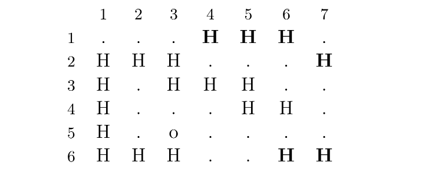

# [OBI-2017] Olímpiada Brasileira de Informática - Mapa

Harry ganhou um mapa mágico no qual ele pode visualizar o trajeto realizado por seus amigos. Ele agora precisa de sua colaboração para, com a ajuda do mapa, determinar onde Hermione se encontra.

O mapa tem L linhas e C colunas de caracteres, que podem ser ‘.’ (ponto), a letra ‘o’ ( minúscula) ou a letra ‘H’ (maiúscula). A posição inicial de Hermione no mapa é indicada pela letra ‘o’. A letra ‘H’ indica uma posição em que Hermione pode ter passado -- o mapa é impreciso, e nem toda letra ‘H’ no mapa representa realmente uma posição pela qual Hermione passou. Mas todas as posições pelas quais Hermione passou são representadas pela letra ‘H’ no mapa.

A partir da posição inicial de Hermione, Harry sabe determinar a posição atual de sua amiga, apesar da imprecisão do mapa, porque eles combinaram que Hermione somente se moveria de forma que seu movimento apareceria no mapa como estritamente horizontal ou estritamente vertical (nunca diagonal). Além disso, Hermione combinou que não se moveria de forma a deixar que Harry tivesse dúvidas sobre seu caminho (por exemplo, Hermione não passa duas vezes pela mesma posição). Considere o mapa abaixo, com 6 linhas e 7 colunas:

A posição inicial de Hermione no mapa é (5,3), e sua posição atual é (4,6). As posições marcadas em negrito (‘H’) são erros no mapa. Dado um mapa e a posição inicial de Herminone, você deve escrever um programa para determinar a posição atual de Herminone.

### Entrada:
A primeira linha contém dois números inteiros L e C, indicando respectivamente o número de linhas e o número de colunas. Cada uma das seguintes L linhas contém C caracteres.

### Saída:
Seu programa recursivo deve produzir uma única linha na saída, contendo dois números inteiros: o número da linha e o número da coluna da posição atual de Hermione.

Restrições:
* 2 ≤ L ≤ 100
* 2 ≤ C ≤ 100
* Apenas os caracteres ‘.’, ‘o’ e ‘H’ aparecem no mapa.
* A letra ‘o’ aparece exatamente uma vez no mapa.
* A letra ‘H’ aparece ao menos uma vez no mapa.
* O caminho de Hermione está totalmente contido no mapa.
* Na posição da letra ‘o’ no mapa, há apenas uma letra ‘H’ como vizinho imediato na vertical ou horizontal.
* Na posição atual de Hermione no mapa, há apenas uma letra ‘H’ como vizinho imediato na vertical ou horizontal.
* Em cada uma das posições intermediárias do caminho de Hermione, há exatamente duas letras ‘H’ como vizinhas imediatas na vertical ou horizontal.

## Exemplos:
### Entrada 
    3 4
    HHHH
    H...
    o.HH

### Saída
    1 4

### Entrada	
    6 7
    ...HHH.
    HHH....
    H.HHH..
    H...HH.
    H.o....
    HHH.HH.

### Saída
    4 6

### Média Ponderada:
* Considere que este exercício tem peso 2 (dois) na média ponderada das notas dos exercícios.

#### Adaptado de:
MAPA. OLIMPÍADA BRASILEIRA DE INFORMÁTICA, 2017. Disponível em: https://olimpiada.ic.unicamp.br/pratique/pu/2017/f2/mapa/>. Acesso em: 04, nov 2020.